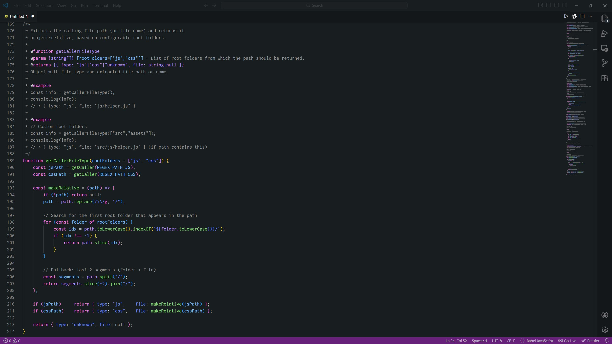
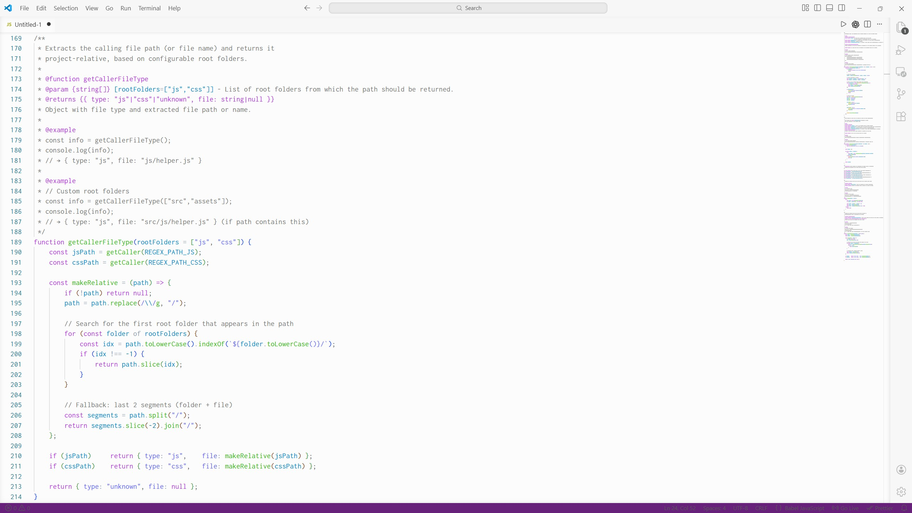

# Firefox DevTools Theme (VS Code)

[![install-badge]](https://marketplace.visualstudio.com/items?itemName=mnowtf.ff-devtools)
[![Visual Studio Marketplace Version][version-badge]](https://marketplace.visualstudio.com/items?itemName=mnowtf.ff-devtools)
[![License: MIT][license-badge]](./LICENSE)

A Visual Studio Code theme inspired by Firefox DevTools.

## Included themes

- **Firefox DevTools Dark**


- **Firefox DevTools Light**


## Install

- **Marketplace:** https://marketplace.visualstudio.com/items?itemName=mnowtf.ff-devtools
- **Manual (VSIX):**
  1. Download the `.vsix` from GitHub Releases
  2. In VS Code: Extensions -> `...` -> Install from VSIX...

## Usage

Open **Preferences: Color Theme** and select:

- `Firefox DevTools Dark`
- `Firefox DevTools Light`

## Development

Prerequisites: Node.js + npm

```bash
npm ci
npm run package
```

This produces a `.vsix` you can install locally (Install from VSIX...).

[version-badge]: https://img.shields.io/badge/version-v0.0.1-mediumorchid?style=flat
[license-badge]: https://img.shields.io/badge/license-MIT-green?style=flat
[install-badge]: https://img.shields.io/badge/vscode-theme-dodgerblue?style=flat
